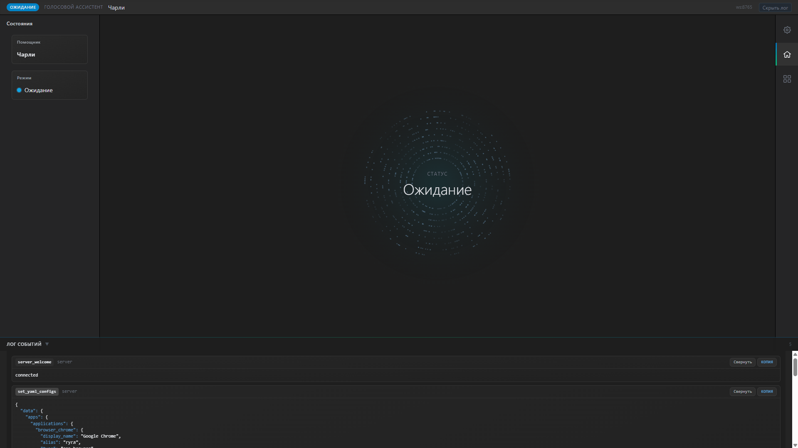

# Desktop Voice Assistant

<div id="badges">


</div>

Интерактивный голосовой ассистент: фронтенд на Electron + React + TypeScript + Tailwind, бэкенд-логика и распознавание речи на Python (Vosk). Между частями — WebSockets.



## 🧩 Архитектура
```
┌──────────────────────────────────┐
│            Electron              │
│  (main.js)                       │
│  • Запуск окна                   │
│  • Запуск Python процесса        │
│  • WebSocketServer (ws://:8765)  │
└──────────────┬───────────────────┘
               │ JSON события
┌──────────────▼───────────────────┐
│  Renderer (React + Vite)         │
│  • SocketClient.ts (reconnect)   │
│  • Атомарный UI + визуализация   │
│  • Лог, состояния, матрица       │
└──────────────┬───────────────────┘
               │ WS сообщения
┌──────────────▼───────────────────┐
│   Python (assistant/)            │
│   • main.py                      │
│   • SocketClient.py (HB, echo)   │
│   • SpeechRecognitionService     │
│   • Assistant (orchestrator)     │
└──────────────────────────────────┘
```

## 🚀 Возможности
- Автозапуск и завершение Python процесса из Electron.
- Двусторонний канал WebSocket.
- Vosk оффлайн распознавание.
- Atomic Design (atoms / molecules / organisms / templates).

## 🛠️ Стек
| Слой | Технологии |
|------|------------|
| Desktop оболочка | Electron |
| Frontend | React 18, TypeScript, Vite, TailwindCSS |
| Realtime | ws (Node), websocket-client (Python) |
| Речь | Vosk, PyAudio |
| Прочее | dotenv, concurrently, cross-env |

## 📦 Установка
```bash
git clone https://github.com/KiyotakkkkA/VoiceAssistant.git
cd ElectronApp
# Windows
.\start --install
```

(На Windows для PyAudio может потребоваться предварительно установить wheel: см. https://www.lfd.uci.edu/~gohlke/pythonlibs/#pyaudio)

### 2. Модели Vosk
Скачайте нужную русскую модель (например `vosk-model-small-ru-0.22`) и распакуйте в:
```
resources/models/voice_small
```
Проверь путь в `.env` (VOICE_RECOGNITION_MODEL_DIR_PATH).

### 3. Обучение модели
1) По умолчанию модель имеет 5 датасетов, лежащие в директории resources/datasets
    - system_brightness.txt
    - system_volume.txt
    - create_project.txt
    - open_project.txt
    - open_app.txt

Шаблон строки:
```plaintext
[Команда на естественном языке] \t [Токен обработки (отвечает за то, какой обработчик получит эту команду)]
```
где \t - табуляция

2) Для переобучения/дообучения модели используйте команду:
    - .\start --tr (она автоматически соберёт все .txt датасеты в 1 и переобучит модель)

### 4. YAML-конфигурация
Шаблоны конфигурации находятся в директории resources/configs (добавлять новые сущности по следующим примерам):

- Добавление приложения (apps.yaml):
```yaml
apps: ...
    [токен_приложения]:
        display_name: "[Название приложения]"
        alias: "[ассоциация]"
        type: "[тип приложения]"
        path: "[путь к приложению]"
```

- Добавление проекта для открытия (projects.yaml):
```yaml
projects: ...
    [токен_проекта]:
        display_name: "[Название проекта]"
        alias: "[ассоциация]"
        type: "[тип проекта]"
        path: "[путь к проекту]"
```

- Добавление шаблона проекта (projects.yaml):
```yaml
templates: ...
    [токен_шаблона]:
        display_name: "[Название шаблона]"
        display_name_after_expanding: "[Название проекта после раскрытия]"
        type: "[тип шаблона]"
        aliases:
        - "[ассоциации]" ...
        info:
        stack: 
            - "[технологии]" ...
        folder: "[папка, откуда будет браться шаблон]"
```

## ▶️ Запуск (режим разработки)
Одной командой (запустит Vite, tsc watcher и Electron):
```bash
# Windows
.\start --dev
```
Electron автоматически поднимет WebSocket сервер и процесс Python.

## 🏗️ Продакшн сборка
```bash
npm run build
npm run start:prod
```
`vite build` соберёт фронтенд в `dist/`, Electron загрузит локальный файл.

## 🔌 Протокол сообщений
Пример формата:
```jsonc
{
  "type": "wake" | "transcript" | "python_heartbeat" | "ui_message" | "python_shutdown" | "server_ack" | ...,
  "from": "python" | "ui" | "server",
  "payload": any
}
```
События:
- `server_welcome` – приветствие сервера при подключении.
- `server_ack` – подтверждение любого полученного сообщения.
- `python_heartbeat` – регулярный пинг от Python.
- `wake` – ассистент активирован (начало речевого сегмента).
- `transcript` – финальная расшифровка фразы.
- `python_shutdown` – корректное завершение.
- `ui_message` – отправлено из интерфейса вручную.
- `set_yaml_configs` – подгрузка yml конфигов. 
- `set_json_data` – подгрузка json данных. 
- `ui_show_set_brightness` – обновление яркости. 
- `ui_show_set_volume` – обновление громкости. 
- `action_open_app_path` – действие открытия приложения. 
- `action_set_theme` – действие смены цветовой темы. 
