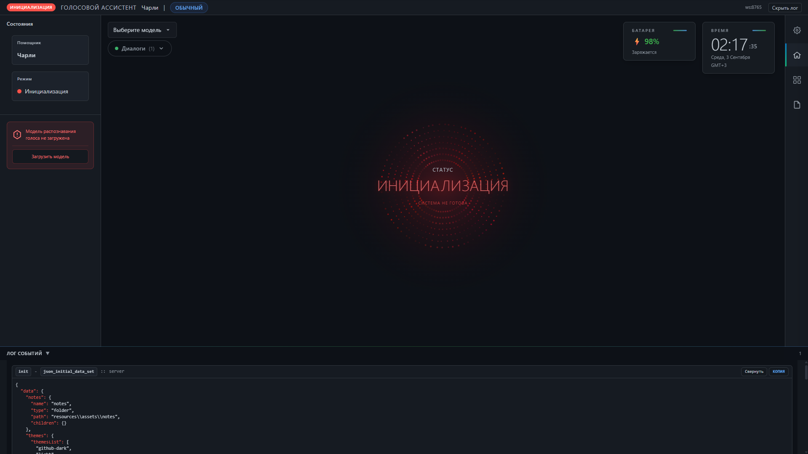
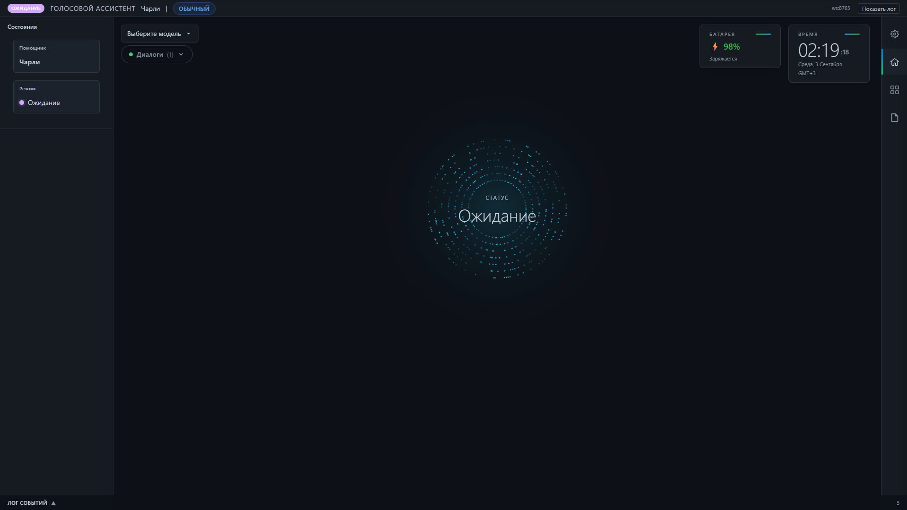

# Desktop Voice Assistant

<div id="badges">

### Интерфейс:


### Клиент:


### Модули:


### Прочее:


### Интеграции:


</div>

## 🧩 Схема взаимодействий


## 🧩 Интерфейс

### Стадия инициализации:


### Стадия ожидания


## 📦 Установка
```bash
git clone https://github.com/KiyotakkkkA/VoiceAssistant.git
cd ElectronApp
# Windows
.\start --install
```

(На Windows для PyAudio может потребоваться предварительно установить wheel: см. https://www.lfd.uci.edu/~gohlke/pythonlibs/#pyaudio)