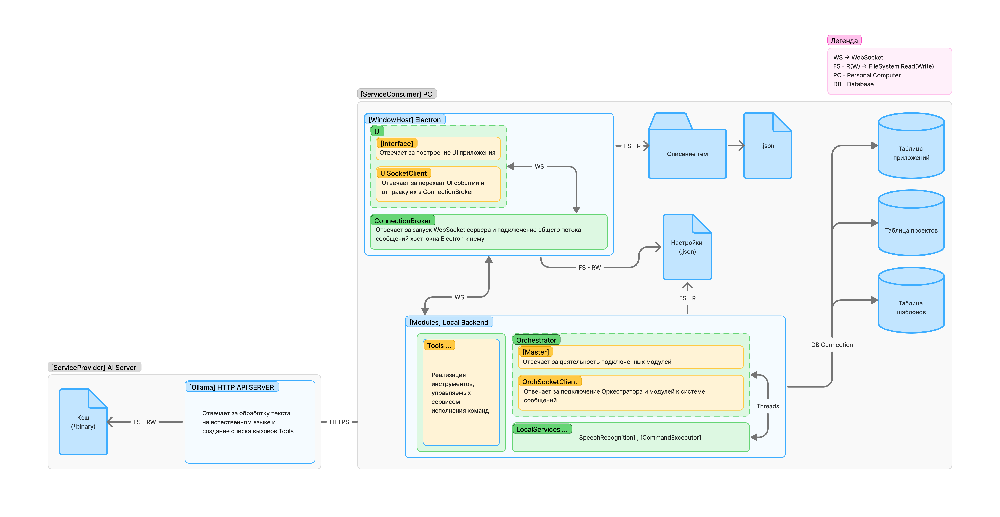

# Desktop Voice Assistant

<div id="badges">


</div>

Интерактивный голосовой ассистент: фронтенд на Electron + React + TypeScript + Tailwind, бэкенд-логика и распознавание речи на Python (Vosk). Между частями — WebSockets.

## 🧩 Схема взаимодействий


## 🧩 Интерфейс

### Стадия инициализации:


### Стадия ожидания


## 🧩 Внутренняя Архитектура
```
┌──────────────────────────────────┐
│            Electron              │
│  (main.js)                       │
│  • Окно приложения               │
│  • WebSocketServer (ws://:8765)  │
│  • Запуск Python процесса        │
└──────────────┬───────────────────┘
               │ JSON события
┌──────────────▼───────────────────┐
│  Renderer (React + Vite)         │
│  • SocketClient.ts (reconnect)   │
│  • UI / визуализация / логи      │
└──────────────┬───────────────────┘
               │ WS сообщения
┌──────────────▼─────────────────────────────────────────────────────────┐
│                    Python (Оркестратор + Модули)                       │
│  ┌───────────────────────────┐          Shared                         │
│  │ Orchestrator (modules/    │          • clients/ModuleClient.py      │
│  │ master.py)                │          • enums/Events.py              │
│  │  • Загрузка manifest'ов   │          • paths.py                     │
│  │  • Старт/стоп модулей     │                                         │
│  │  • Реестр сервисов        │──────────┬                              │
│  └───────────────┬───────────┘          │                              │
│                  │ запускает            │                              │
│  ┌───────────────▼───────────┐     ┌────▼─────────────────────────┐    │
│  │ speech_rec_module         │     │ processing_module            │    │
│  │  • main.py                │     │  • main.py                   │    │
│  │  • Recognizer (Vosk)      │     │  • Executor                  │    │
│  │  • SpeechRecognitionSvc   │     │  • AiService, Tools          │    │
│  └───────────────────────────┘     └──────────────────────────────┘    │
│  Каждый модуль = WS‑клиент (ModuleClient: heartbeat, reconnect, route) │
└────────────────────────────────────────────────────────────────────────┘
```

## 🚀 Возможности
- Автозапуск и завершение Python процесса из Electron.
- Двусторонний канал WebSocket.
- Vosk оффлайн распознавание.
- Atomic Design (atoms / molecules / organisms / templates).

## 🛠️ Стек
| Слой | Технологии |
|------|------------|
| Desktop оболочка | Electron |
| Frontend | React 18, TypeScript, Vite, TailwindCSS |
| Realtime | ws (Node), websocket-client (Python) |
| Речь | Vosk, PyAudio |
| Прочее | dotenv, concurrently, cross-env |

## 📦 Установка
```bash
git clone https://github.com/KiyotakkkkA/VoiceAssistant.git
cd ElectronApp
# Windows
.\start --install
```

(На Windows для PyAudio может потребоваться предварительно установить wheel: см. https://www.lfd.uci.edu/~gohlke/pythonlibs/#pyaudio)

### 2. Модели Vosk
В случае отсутствия модели распознавания речи - вам будет предложено автоматически скачать
её (Блок в левой части главного экрана), однако, вы можете сделать это и вручную

Скачайте нужную русскую модель (например `vosk-model-small-ru-0.22`) и распакуйте в:
```
resources/models/voice_small
```

После этого в файле
```
resources/global/config.json
```
установите название модели соответствующее её относительному пути для папки resources/models

## ▶️ Запуск (режим разработки)
Одной командой (запустит Vite, tsc watcher и Electron):
```bash
# Windows
.\start --dev
```
Electron автоматически поднимет WebSocket сервер и процесс Python.

## 🏗️ Продакшн сборка
```bash
npm run build
npm run start:prod
```
`vite build` соберёт фронтенд в `dist/`, Electron загрузит локальный файл.

# Функционал

## Визуальный
1. Смена цветовых тем

## Работа с файловой системой
1. Создание и редактирование заметок (.txt файлы по правилам Markdown)

## Инструменты голосового ассистента
1. Поиск информации в интернете
2. Сбор и вывод информации о сети и сетевых интерфейсах ПК
3. Сбор и вывод информации о характеристиках ПК
4. Управления заметками
5. Сбор и вывод информации Github пользователя (при ссылки и PAT в разделе "Учётные записи")
6. Управление Docker средой (запуск, остановка контейнеров, просмотр информации о контейнерах и образах)

# Доступ к AI
Осуществляется посредством интеграции сервиса Ollama (на данные момент через API Ключ)

Получить его можно на сайте ollama.com

НАСТОЯТЕЛЬНО РЕКОМЕНДУЮ ИСПОЛЬЗОВАТЬ МОДЕЛЬ <b>gpt-oss:20b</b>